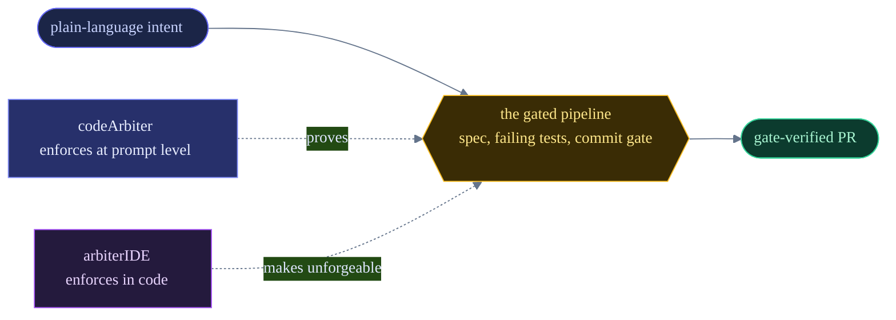

<div align="center">


<br/><br/>

<b>We build developer tooling where the gate is enforced, not suggested.</b>
<br/>
Intent goes in. A gate-verified PR comes out. Every time.

</div>

---

## The thesis

One rule runs through everything here: no code reaches a branch without clearing the same gated
pipeline, and the proof is never forgeable. We build that rule at two depths.



## Projects

### codeArbiter

An orchestration layer for [Claude Code](https://claude.com/claude-code) that refuses to freelance.
Every intent routes through a slash command to a gated skill or reviewer agent. Nothing commits
until the gates are green, decisions go through SMARTS, and the audit trail (`overrides.log`, ADRs,
the sprint log) is append-only and mechanically guarded. It proves the workflow at prompt level,
inside the session.

```
/plugin marketplace add arbiterForge/codeArbiter
/plugin install ca@codearbiter
```

Requires Python 3 on `PATH`. Dormant in every repo until you run `/ca:init`, and it writes only to
`.codearbiter/`. See [arbiterForge/codeArbiter](https://github.com/arbiterForge/codeArbiter).

### arbiterIDE

Proving the workflow at prompt level has a ceiling. A gate that lives in a transcript is skippable
by a sufficiently creative session, and evidence written as a marker file can be forged.
arbiterIDE moves the structure into code. Gates become interceptors at a single tool-dispatch
chokepoint. Evidence becomes unforgeable tokens bound to content hashes. The commit path becomes
the only commit path, and CI re-runs the same gate package server-side, so even a hostile client
cannot fake a verdict.

Built on Eclipse Theia, desktop-first, currently pre-alpha. See
[arbiterForge/arbiterIDE](https://github.com/arbiterForge/arbiterIDE).

## Contact

brennonhuff@gmail.com
